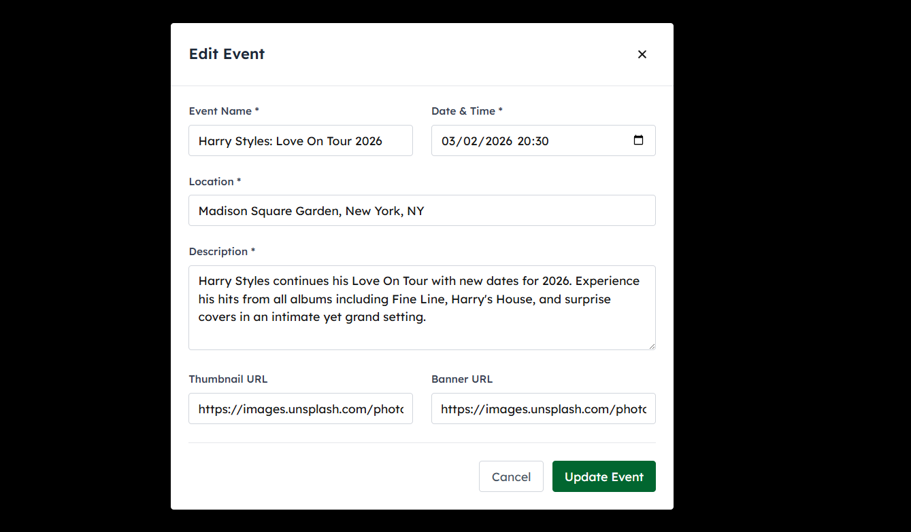

# 🎫 Concert Ticket Booking System

A modern, full-stack concert ticket booking application built with Next.js, featuring real-time ticket management, secure payment processing with Midtrans, and an intuitive admin dashboard.

## ✨ Features

### 🎭 For Concert Goers
- **Browse Events**: View upcoming concerts with detailed information
- **Ticket Selection**: Choose from multiple ticket classes (VIP, General, etc.)
- **Secure Payments**: Integrated Midtrans payment gateway
- **Real-time Availability**: Live ticket availability updates
- **Booking Management**: View and manage your bookings

### 👨‍💼 For Administrators
- **Event Management**: Create, edit, and delete events
- **Ticket Generation**: Generate tickets for different classes
- **User Management**: Manage user accounts and roles
- **Booking Overview**: Monitor all bookings and payments
- **Dashboard Analytics**: Real-time insights and statistics

## 🖼️ Application Screenshots

### Homepage & Navigation
<!-- Screenshot: Homepage with hero section and upcoming events -->


### Event Details & Ticket Purchase
<!-- Screenshot: Event detail page with ticket selection -->


<!-- Screenshot: Ticket purchase flow with quantity selection -->


### Payment Processing
<!-- Screenshot: Midtrans payment popup -->


<!-- Screenshot: Payment success page -->


### Admin Dashboard
<!-- Screenshot: Admin dashboard overview -->


<!-- Screenshot: Event creation/editing modal -->


<!-- Screenshot: Ticket generation interface -->


### User Authentication
<!-- Screenshot: Login page -->


<!-- Screenshot: Registration page -->


###  & Bookings
<!-- Screenshot: Booking history -->


## 🚀 Tech Stack

### Frontend
- **Next.js 14** - React framework with App Router
- **TypeScript** - Type-safe development
- **Tailwind CSS** - Utility-first CSS framework
- **NextAuth.js** - Authentication solution
- **React Hook Form** - Form handling and validation

### Backend Integration
- **NestJS** - Backend API framework
- **PostgreSQL** - Database
- **JWT** - Authentication tokens
- **Class Validator** - DTO validation

### Payment & Services
- **Midtrans** - Payment gateway integration
- **Snap API** - Payment popup interface
- **Webhooks** - Payment status notifications

## 📋 Prerequisites

Before running this application, make sure you have:

- **Node.js** (v18 or higher)
- **npm** or **pnpm** package manager
- **Backend API** running (NestJS server)
- **PostgreSQL** database
- **Midtrans** account and API keys

## 🛠️ Installation

1. **Clone the repository**
   ```bash
   git clone <repository-url>
   cd concert-ticket-booking
   ```

2. **Install dependencies**
   ```bash
   npm install
   # or
   pnpm install
   ```

3. **Environment Setup**
   Create a `.env.local` file in the root directory:
   ```env
   # Backend API
   NEXT_PUBLIC_BACKEND_URL=http://localhost:8000
   
   # NextAuth Configuration
   NEXTAUTH_URL=http://localhost:3000
   NEXTAUTH_SECRET=your-secret-key
   
   # Midtrans Configuration
   NEXT_PUBLIC_MIDTRANS_CLIENT_KEY=your-midtrans-client-key
   MIDTRANS_SERVER_KEY=your-midtrans-server-key
   MIDTRANS_MERCHANT_ID=your-midtrans-merchant-id
   
   # Database (if needed)
   DATABASE_URL=your-database-url
   ```

4. **Run the development server**
   ```bash
   npm run dev
   # or
   pnpm dev
   ```

5. **Open your browser**
   Navigate to [http://localhost:3000](http://localhost:3000)

## 🔧 Configuration

### Backend API
Ensure your NestJS backend is running on the configured URL (default: `http://localhost:8000`)

### Midtrans Setup
1. Create a Midtrans account
2. Get your Client Key and Server Key
3. Configure webhook URLs in Midtrans dashboard
4. Update environment variables

### Authentication
The application uses NextAuth.js with JWT strategy. Configure your backend authentication endpoints in the NextAuth configuration.

## 📱 Key Pages & Routes

### Public Pages
- `/` - Homepage with upcoming events
- `/event/[id]` - Event details and ticket purchase
- `/about` - About page
- `/contact` - Contact information
- `/faq` - Frequently asked questions
- `/terms` - Terms of service

### Authentication
- `/signin` - User login
- `/signup` - User registration
- `/signout` - User logout

### Payment
- `/payment/success` - Payment success page
- `/payment/pending` - Payment pending page
- `/payment/error` - Payment error page

### Protected Routes
- `/admin` - Admin dashboard (Admin role required)
- `/profile` - User profile (Authenticated users)
- `/myreservation` - User bookings (Authenticated users)

## 🔐 Authentication & Authorization

### User Roles
- **USER** - Can browse events, purchase tickets, view bookings
- **ADMIN** - Full access to admin dashboard, event management, ticket generation

### Protected Routes
The application uses middleware to protect routes:
- Admin routes require ADMIN role
- User routes require authentication
- Unauthorized access redirects to signin page

## 💳 Payment Flow

1. **User selects tickets** and quantity
2. **Booking data prepared** with ticket class IDs
3. **Payment initiated** through Midtrans Snap
4. **Payment processed** via Midtrans gateway
5. **Booking confirmed** after successful payment
6. **Tickets assigned** to user account

## 🎫 Ticket Management

### Ticket Classes
- **VIP Package** - Premium seating with additional benefits
- **General Admission** - Standard seating
- **Student Discount** - Special pricing for students
- **Early Bird** - Limited time discounted tickets

### Ticket Generation
Admins can generate tickets for events:
1. Create ticket classes with pricing
2. Specify quantity for each class
3. Generate individual tickets with seat numbers
4. Monitor availability in real-time

## 🚀 Deployment

### Vercel (Recommended)
1. Connect your GitHub repository to Vercel
2. Configure environment variables
3. Deploy automatically on push

### Other Platforms
The application can be deployed to any platform that supports Next.js:
- Netlify
- Railway
- DigitalOcean App Platform
- AWS Amplify

## 🤝 Contributing

1. Fork the repository
2. Create a feature branch (`git checkout -b feature/amazing-feature`)
3. Commit your changes (`git commit -m 'Add amazing feature'`)
4. Push to the branch (`git push origin feature/amazing-feature`)
5. Open a Pull Request

## 📄 License

This project is licensed under the MIT License - see the [LICENSE](LICENSE) file for details.

## 🆘 Support

If you encounter any issues or have questions:

1. Check the [FAQ](/faq) page
2. Review the [API Documentation](API_DOCUMENTATION.md)
3. Create an issue in the repository
4. Contact support at support@concerto.com

## 🔄 Changelog

### Version 1.0.0
- Initial release
- Event management system
- Ticket booking with Midtrans integration
- Admin dashboard
- User authentication and authorization
- Real-time ticket availability

---

**Built with ❤️ for the concert community**
